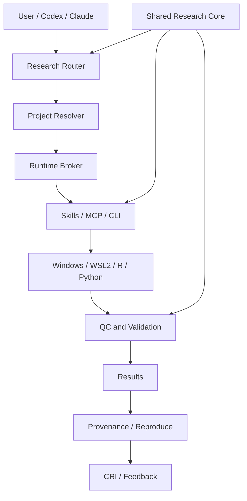

# Architecture / 架构

## English

The public candidate separates project facts, research contracts, execution
adapters and validation. Windows/Codex/Office interactions may remain at the
edge; deterministic Python, R, CLI or WSL2 runners are selected only when the
project and runtime are explicitly available.

`skills/shared/` is the single source of truth for privacy, statistical-unit,
QC, provenance, evidence and release rules. `skills/codex/` and
`skills/claude/` are thin platform adapters. External MCP/CLI/database tools
are optional capabilities, not bundled credentials or data sources.

## 中文

公开候选版将项目事实、科研契约、执行适配器和验证层分开。Windows/Codex/Office
可以作为交互入口；只有在项目和运行时明确可用时，才选择 Python、R、CLI 或 WSL2
等确定性执行层。

`skills/shared/` 是隐私、统计单位、QC、provenance、证据和发布规则的单一事实来源。
Codex 和 Claude 适配器只负责平台调用，不重复科研方法学。外部 MCP/CLI/数据库工具
是可选能力，不携带凭据或数据。
